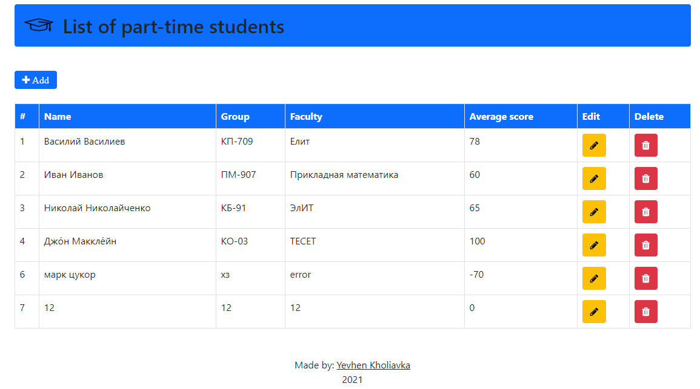

# Student registration

# About the app
This application is a registry of people built with PHP (MVC standard), MySQL, Vue.js.

## Available functions
* Add students
* Edit information

## Screeshoots

## Installation
- Import the "Base.sql" file into your mysql database.

- Set up config / connection.php file with your server settings.
``
$ hostname = 'localhost'; // Hostname of your database server - example: localhost
$ database = 'Base'; // Database name
$ username = 'root'; // Username,
$ password = ''; // Password used to connect to the database
